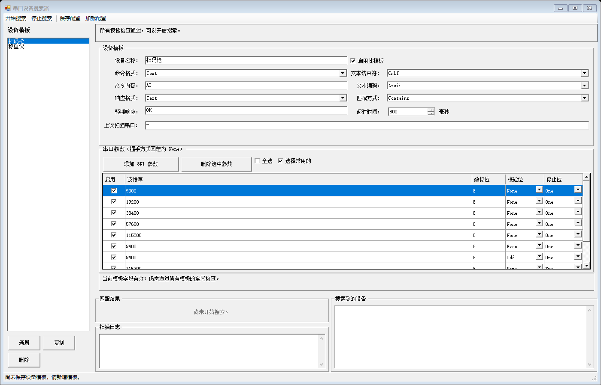
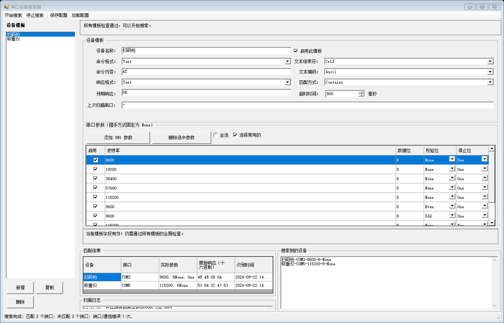

# Serial Port Finder

[简体中文](README.md) | **English**

**A serial device locator for Windows industrial sites**: it probes COM ports one by one against
the "device templates + serial parameter combinations" you define, and tells you
**which port the device is attached to**.

[](LICENSE)
[](#requirements)
[](#requirements)

> **Note: the user interface and documentation are in Simplified Chinese.**

---

## What problem does it solve

A common situation on industrial sites: **a device is connected through a USB-to-serial adapter,
the Device Manager shows several COM ports, but you have no idea which port the device is on.**
Trying them by hand is slow and error-prone — especially when the device only responds at a
specific baud rate or after receiving a specific query command.

This tool lets you describe "how to recognize this device" as a **template** (which command to send,
what response to expect, which serial parameters to try), then it automatically walks through every
COM port on the machine and gives you the answer.

## Screenshots



After a scan, matched devices are listed under "Matched Results", and "Devices Found" summarizes
each device together with the port it was found on:



---

## What it does

- Probes every COM port sequentially: **send a query command → check whether the response matches**
  to identify the device
- Each template can hold multiple serial parameter sets (baud rate / data bits / parity / stop bits),
  tried one combination after another
- Protocols support both **text and hex** formats; matching supports **contains and exact equality**
- Templates can be saved to a configuration file and copied to other machines running the same model
- Multiple templates can be enabled at once — **the first match stops further probing on that port**

## What it does not do

- ❌ **No continuous communication** — the port is closed right after each probe; it is not a serial terminal
- ❌ **No writing or control** — it only sends the identification commands you configure
- ❌ **No automatic protocol detection** — you need to know the device's query command beforehand

---

## Key features

| Feature | Description |
|---|---|
| No installation | Extract and run; no registry writes; delete the folder to uninstall |
| Sequential scan | Ports sorted naturally by COM number (COM10 after COM2) |
| Parameter sets | 26 common combinations built in, checked row by row; row order is scan order, auto-sorted "checked → common → uncommon" |
| Live feedback | Matched results / devices found / scan log / status bar, all updated together |
| Interruptible | "Stop" ends after the current port closes safely and explicitly marks results as partial — it never reports "finished" by mistake |
| Validation | Field and duplicate-name validation; failing validation disables "Start" and states the reason |
| Config persistence | Templates saved to `devices.json` (atomic write); older configs remain compatible |
| Offline build | The NuGet package cache ships with the repository, so restore and build need no network |

---

## Requirements

| Purpose | Requirement |
|---|---|
| **Running the app** | Windows 10 or later (.NET Framework 4.8 ships with the OS) |
| **Building from source** | Visual Studio 2019 / 2022 (with the ".NET desktop development" workload) + .NET Framework 4.8 targeting pack |

---

## Get and run

The application is **self-contained**: apart from the .NET Framework 4.8 that ships with Windows,
it needs no runtime and no other prerequisites.

### Option 1: Portable zip (simplest, recommended)

Download **`SerialPortFinder-v*-portable.zip`** from the
**[Releases](https://github.com/clxa/Serial-Port-Finder/releases)** page, extract it anywhere,
and double-click `SerialPortDeviceFinder.WinForms.exe`. Delete the folder to uninstall.

> Extract to a path **without non-ASCII characters or spaces** (e.g. `D:\SerialPortFinder\`) to be safe.
> A user guide (interface walkthrough, field reference, FAQ) is included in the archive.

### Option 2: Installer (a proper install/uninstall experience)

Download **`SerialPortFinder-Setup-v*.exe`** from the
**[Releases](https://github.com/clxa/Serial-Port-Finder/releases)** page and double-click it:

- **No administrator rights required** (installs into the current user's program directory)
- Creates Start Menu and desktop shortcuts, and registers an uninstall entry under "Apps & features"
- Uninstalling does **not** delete `devices.json`, so **reinstalling or upgrading keeps your device templates**

> The binaries are not digitally signed, so Windows SmartScreen may show "Windows protected your PC"
> on first run. Choose "More info" → "Run anyway".

### Option 3: Build from source

```bash
git clone https://github.com/clxa/Serial-Port-Finder.git
cd Serial-Port-Finder
dotnet build SerialPortDeviceFinder.sln -c Debug
dotnet run --project src/SerialPortDeviceFinder.WinForms
```

> **Offline build note**: the repository ships the NuGet package cache in `packages/` and points
> `NuGet.config` at it, so **restore needs no network**.
> The **first build still requires the .NET Framework 4.8 reference assemblies** (the
> ".NET desktop development" workload in Visual Studio, or the standalone .NET Framework 4.8
> Developer Pack). Without them, a bare .NET SDK installation will try to fetch the reference
> assemblies online on the first `dotnet build`.

---

## Workflow

The shortest path:

```
New template → fill in the identification protocol → check serial parameters → validation passes → Start → Save
```

For a text device that answers `OK` to `AT`, fill the template like this:

| Field | Value |
|---|---|
| Device name | `Barcode scanner` (must not duplicate another template) |
| Enable this template | ☑ |
| Command format | Text |
| Command content | `AT` |
| Text terminator | Per the device manual (usually `CrLf`) |
| Response format | Text |
| Expected response | `OK` |
| Match mode | Contains (use "Exact" for stricter matching) |
| Text encoding | `Ascii` |
| Timeout | `800` ms (raise it for slow devices; range 100–10000) |

> For hex devices, switch "Command format / Response format" to `Hex` and write space-separated
> bytes, e.g. `41 54` (which is `AT`).

For a full interface walkthrough and FAQ, see the user guide included in the release archive
(in Simplified Chinese).

---

## Configuration (`devices.json`)

- After you click "Save", templates are written to `devices.json` **next to the executable**.
- The app **loads `devices.json` from the same directory on startup**; a missing file is treated as
  an empty configuration and does not raise an error.
- Moving to another machine: copy the release folder over, then place `devices.json` in the same
  directory.
- The file is plain JSON and can be backed up or edited by hand. Its structure (as actually written
  by the app) is:

```jsonc
[
  {
    "Name": "Barcode scanner",        // device name (must be unique among templates)
    "IsEnabled": true,                // whether it takes part in scanning
    "CommandFormat": 0,               // command format: 0=text, 1=hex
    "CommandContent": "AT",           // for hex format write "41 54"
    "TextTerminator": 3,              // text terminator: 0=none, 1=CR, 2=LF, 3=CRLF (text commands only)
    "ResponseFormat": 0,              // response format: 0=text, 1=hex
    "ExpectedResponse": "OK",
    "MatchMode": 0,                   // match mode: 0=contains, 1=exact
    "TextEncoding": 0,                // text encoding: 0=ASCII, 1=UTF-8, 2=GBK
    "TimeoutMilliseconds": 800,       // 100 ~ 10000
    "LastScanPortName": "COM3",       // read-only display: port of the last match, written back by the app
    "PortSettings": [
      { "BaudRate": 9600, "DataBits": 8, "Parity": 0,
        "StopBits": 1, "Handshake": 0, "Enabled": true }
    ]
  }
]
```

> ⚠️ **Enums are stored as numbers in the file**, not as strings. Reference table:

| Field | Values |
|---|---|
| `CommandFormat` / `ResponseFormat` | `0`=text, `1`=hex |
| `TextTerminator` | `0`=none, `1`=CR, `2`=LF, `3`=CRLF |
| `MatchMode` | `0`=contains, `1`=exact |
| `TextEncoding` | `0`=ASCII, `1`=UTF-8, `2`=GBK |
| `Parity` | `0`=None, `1`=Odd, `2`=Even, `3`=Mark, `4`=Space |
| `StopBits` | `1`=1 bit, `2`=2 bits, `3`=1.5 bits |
| `Handshake` | fixed `0` (None) — no other value is allowed |

> Prefer **editing and saving through the UI** over hand-editing the JSON.
> Older configurations that lack `PortSettings[].Enabled` are read as enabled and keep working.

---

## Project layout

```
SerialPortDeviceFinder.sln
├─ src/
│  ├─ SerialPortDeviceFinder.Core/       pure logic: protocol codec, response matching, scan scheduling, validation, config I/O
│  └─ SerialPortDeviceFinder.WinForms/   WinForms UI (main form + template editor)
├─ tests/SerialPortDeviceFinder.Core.Tests/   NUnit tests (including STA UI tests)
├─ build/                                packaging scripts (release zip / installer)
├─ assets/                               screenshots used by the README
└─ packages/                             NuGet package cache (shipped, enables offline builds)
```

**Scan pipeline**: ports (outer) → templates (middle) → parameter combinations (inner), opening the
port once per combination; a match stops that port; exceptions (port busy / communication failure)
are recorded as a result and scanning continues with the next one.

---

## Safety

> ⚠️ **The identification commands in your templates must be side-effect-free queries or status reads.**
>
> This tool sends commands **to every candidate serial port for real**. Do not configure commands
> that start a device, change parameters, clear data, trigger a reset, or otherwise alter production
> state. Validate with a single port and a single parameter combination before scanning in bulk.

See [SECURITY.md](SECURITY.md).

---

## FAQ

**Nothing matched?** Check in order: is the device powered and the cable seated; is the needed
serial parameter set **checked** (unchecked rows are greyed out and are not scanned); does the
command contain stray spaces; does the device require a **terminator** (try `CrLf` or `Cr`); is the
timeout long enough; and does the **expected response differ from what the device actually returns** —
look at the "response XX XX" line in the scan log, that is the real reply, so adjusting the expected
response to match it is the most reliable fix.

**"Start" is greyed out?** Validation failed. The editor hint or the validation summary states the
reason (most common: empty command or expected response, no serial parameter checked, timeout outside
100–10000, duplicate template name).

**The log shows `PortUnavailable`?** The port is in use. Close other serial tools (or another instance
of this tool) and retry.

**A device matched but it is the wrong one?** The identification criteria are too loose. Use a string
**unique** to that device as the expected response, or switch the match mode to **Exact**.

**Garbled text?** Adjust the text encoding: `Gbk` (most domestic devices), `Utf8`, or `Ascii`.

**Scanning is slow?** The worst case is roughly `ports × templates × checked parameter sets × timeout`.
Trim unused templates and parameter combinations, or lower the timeout.

**Templates gone after moving to another machine?** When copying the release folder, remember to put
`devices.json` next to the executable as well.

---

## Known limitations

- **Sequential, not parallel**: duration grows linearly with `ports × templates × parameter combinations`;
  trim parameter combinations when many ports are present
- **No automatic protocol detection**: you need to know the device's query command beforehand

---

## Feedback and contributions

- **Found a problem**: feel free to open an [Issue](https://github.com/clxa/Serial-Port-Finder/issues).
  Include the raw scan log (with the device's actual responses) — it speeds up diagnosis considerably.
- **Want to change the code**: Pull Requests are welcome.

---

## Author

- GitHub: [@clxa](https://github.com/clxa)

---

## License

This project is released under the [MIT License](LICENSE).

**In plain terms, MIT lets you:**

- ✅ **Use commercially** — internal company use, integration into commercial products, and
  redistribution with your product all require **no fee and no permission request**
- ✅ **Modify** — change the code, the UI, add or remove features
- ✅ **Redistribute** — package it and hand it out, even sell it
- ✅ **Integrate into closed source** — fold it into your own project without publishing your code

**The only requirement (exactly as MIT states): keep the attribution when you redistribute the code.**
Ship the `LICENSE` file (which contains the copyright notice and the full license text) along with
the code — no extra notice in your UI or docs is needed.

> Note: MIT's attribution requirement applies to **distributing source code**. If you merely use a
> compiled executable as a tool, no attribution is required. The software is provided "as is",
> without warranty of any kind.

### Third-party components

The MIT license **covers only this repository's own source code**. Third-party content inside the
repository keeps its original license:

| Content | License |
|---|---|
| NuGet packages under `packages/` (Newtonsoft.Json, NUnit, Roslynator, etc.) | their respective open-source licenses |
| `build/ChineseSimplified.isl` (Inno Setup community Simplified Chinese translation, by Zhenghan Yang) | MIT |
